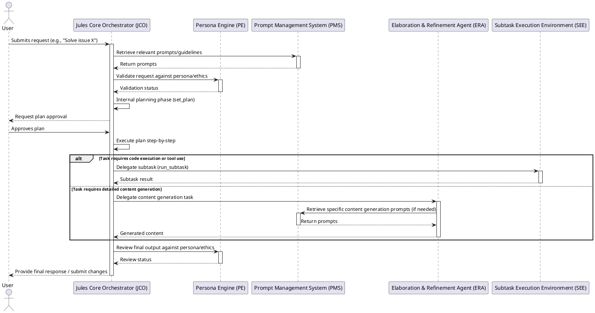

# JULES System Architecture Overview (Simulated)

This document provides a high-level overview of the JULES agentic system architecture, as derived from its foundational prompts and operational mandate. This architecture is conceptual and represents a model for JULES's self-understanding and future development.

## 1. Major Components

The JULES system is envisioned as a modular architecture composed of several key components:

| Component ID                      | Component Name                    | Derived From Prompt(s) | Core Role                                                                 | Notional Maturity |
|-----------------------------------|-----------------------------------|------------------------|---------------------------------------------------------------------------|-------------------|
| JCO-001                           | Jules Core Orchestrator         | SYS_CORE_001           | Overall control, user interaction, planning, task delegation, tool usage. | Beta              |
| PE-001                            | Persona Engine                    | PERS_JULES_001         | Maintaining persona consistency, applying ethical guidelines.             | Beta              |
| ERA-001                           | Elaboration & Refinement Agent  | AGENT_ELABORATE_001    | Expanding outlines, generating detailed textual content.                  | Alpha             |
| SEE-001                           | Subtask Execution Environment     | SYS_CORE_001 (implied) | Secure sandboxed environment for running arbitrary code and tools.        | Production        |
| PMS-001                           | Prompt Management System          | Implicit               | Storage, versioning, and retrieval of system and agent prompts.           | Pre-Alpha         |
| LTR-001                           | Learning & Adaptation Module      | Implicit               | Processing feedback, updating knowledge, evolving strategies (long-term). | Concept           |

## 2. Primary Call Flow (Illustrative)

The following PlantUML diagram illustrates a typical interaction flow within the JULES system when handling a complex user request that requires planning and content generation.

## 3. Legend for Diagrams and Diffs

This section provides a legend for interpreting architectural diagrams and tracking changes over time.

### Component Maturity Levels:
*   **Concept:** Idea phase, not yet implemented.
*   **Pre-Alpha:** Initial design and prototyping.
*   **Alpha:** Basic functionality implemented, internal testing.
*   **Beta:** Feature complete, undergoing wider testing, known issues may exist.
*   **Production:** Stable, deployed, and actively maintained.
*   **Deprecated:** No longer in active use or development.

### Relationship Types (for future detailed diagrams):
*   `-->`: Direct synchronous call
*   `-->>`: Direct asynchronous call
*   `..>`: Data flow / dependency
*   `--o`: Composition
*   `--*`: Aggregation

### Change Indicators (for future diffs of this document):
*   **[NEW]**: Newly added component or feature.
*   **[MOD]**: Modified component or feature.
*   **[DEP]**: Deprecated component or feature.
*   **[REM]**: Removed component or feature.

---
*This architecture overview is a living document and will evolve as JULES itself evolves.*
